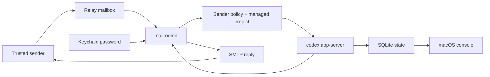

# Patch Courier

[](https://github.com/owenshen0907/patch-courier/actions/workflows/build.yml)
[](LICENSE)

**Language / 语言 / 言語:** [中文](README.md) | [English](README.en.md) | [日本語](README.ja.md)

## English

Patch Courier lets you keep coding from wherever you are by turning trusted email threads into local Codex work.
Email is the human-facing ingress, approval, and notification channel; execution stays on your Mac through `codex app-server`, so repository access, credentials, and policy decisions remain local.

### Project status

Patch Courier is an early, daemon-first macOS prototype. It is useful for experimentation and local operator workflows, but the public API, storage schema, and onboarding flow should still be treated as pre-1.0.

### What exists now

- `MailroomDaemon` / `mailroomd` boots native `codex app-server` over stdio JSON-RPC.
- Patch Courier provisions an app-scoped `CODEX_HOME` and seeds the minimal Codex profile artifacts it needs from the operator profile so native turns still use the same provider/auth setup.
- thread records, approval requests, and raw event logs are persisted in SQLite at `~/Library/Application Support/PatchCourier/mailroom.sqlite3` by default.
- turn records are now persisted in the same SQLite store, including origin, latest lifecycle state, and the last mail outcome already notified.
- mailbox sync cursors, mailbox accounts, and sender policies now live in the same SQLite store, while mailbox passwords remain in Keychain.
- SQLite schema compatibility is tracked with `PRAGMA user_version`; see `docs/STORAGE_MIGRATIONS.md` for the migration policy.
- `mailroomd` can now run one-shot mailbox syncs or a long-lived mail loop that polls mailboxes quickly, fans work out to per-thread background workers, and sends completion / approval emails back out.
- the long-lived daemon now performs startup recovery for durable mail turns, suppresses already-sent approval reminders, and marks unrecoverable active turns as timed-out system errors instead of waiting forever.
- the long-lived daemon now exposes a localhost JSON control plane, publishes a control file under the support root, and can answer live `state/read`, `approval/resolve`, and daemon-owned config mutation requests.
- the macOS app now polls that daemon control plane to show live threads / turns / approvals, and saves mailbox / sender-policy changes against the same running daemon session.
- the daemon control snapshot now includes per-lane worker summaries, so the macOS console can show which mailbox worker is running, what message it is handling, and whether backlog is building up behind it.
- the daemon control snapshot now also includes per-mailbox poll health, so operators can see password readiness, next poll timing, sync cursor progress, and recent transport failures separately from downstream worker execution state.

### Current architecture split

- `Runtime/` typed Codex App Server transport and Mailroom domain models
- `Daemon/` daemon bootstrap, SQLite store, approval email codec, and CLI probes
- `Shared/` existing macOS console and mailbox workflow prototype
- `docs/TARGET_ARCHITECTURE.md` target blueprint for the daemon-first design

### Why this direction

The target product is a native macOS mail operator that can:

- receive approved inbound email requests
- map one mail thread to one Codex thread when possible
- survive UI restarts because mailbox state and approvals live in a daemon
- send approval requests or completion summaries back over email

The critical runtime detail discovered during probing is that `codex app-server` needs a writable `CODEX_HOME` to create threads reliably, but real turns also need the operator's Codex provider/auth profile. Patch Courier therefore owns its runtime directory while mirroring a small set of profile files such as `config.toml`, `.env`, and auth metadata from the selected source Codex home.

### Prerequisites

- macOS with Xcode command line tools installed.
- `xcodegen` available on `PATH`.
- Codex CLI installed locally, with `codex app-server` available.
- A working Codex profile in `~/.codex` or another directory you can point to with `MAILROOM_CODEX_PROFILE_HOME`.

### First Run: Local Probe

This path verifies the daemon and Codex bridge without configuring any real mailbox.

```bash
git clone https://github.com/owenshen0907/patch-courier.git
cd patch-courier
cp .env.local-probe.example .env.local
set -a; source .env.local; set +a

xcodegen generate
DERIVED_DATA_PATH="$PWD/build/DerivedData"
xcodebuild -project PatchCourier.xcodeproj \
  -scheme MailroomDaemon \
  -destination 'platform=macOS' \
  -derivedDataPath "$DERIVED_DATA_PATH" \
  CODE_SIGNING_ALLOWED=NO \
  build

MAILROOMD="$DERIVED_DATA_PATH/Build/Products/Debug/mailroomd"
"$MAILROOMD" --help
"$MAILROOMD" --probe-codex
"$MAILROOMD" --probe-turn --prompt "Reply with exactly hello and nothing else."
```

Expected result:

- `--probe-codex` prints JSON with support paths, platform info, and a Codex thread id.
- `--probe-turn` starts a real Codex turn and returns a completed outcome, unless Codex asks for approval or fails locally.
- Local probe state stays under `.local/support` because `.env.local-probe.example` sets a repo-local `MAILROOM_SUPPORT_ROOT`.

If either probe fails, start with `docs/TROUBLESHOOTING.md` before changing code.

### Render Email Fixtures

Render representative outbound emails locally to inspect subject lines, inbox preview text, HTML layout, and plain-text fallbacks:

```bash
./scripts/render_mail_previews.sh
open .preview/mailroom-emails/index.html
```

The script builds `mailroomd`, renders sample daemon emails, and writes an `index.html` plus per-message `.html` / `.txt` files under `.preview/mailroom-emails` by default. The current fixture set covers immediate receipt, first-contact decision, managed-project selection, approval request, successful completion, failure, rejected request, saved-for-later, and runtime sender confirmation.

### Start a Local Thread

After the local probe succeeds, run a stored Mailroom thread without email transport:

```bash
"$MAILROOMD" --start-thread \
  --sender you@example.com \
  --subject "Repo check" \
  --workspace "$PWD" \
  --prompt "Inspect the workspace and summarize the project structure." \
  --wait

"$MAILROOMD" --list-threads
"$MAILROOMD" --list-turns
"$MAILROOMD" --list-events
```

Use `--continue-thread --token MRM-... --prompt "..." --wait` to continue an existing stored mail thread.

### Mailbox-Enabled Setup

Mailbox polling is the real product loop. Configure it only after the local probe path works.

1. Copy the mailbox profile and adjust paths:

   ```bash
   cp .env.mailbox.example .env.local
   set -a; source .env.local; set +a
   ```

2. Build and launch the macOS app:

   ```bash
   DERIVED_DATA_PATH="${DERIVED_DATA_PATH:-$PWD/build/DerivedData}"
   xcodebuild -project PatchCourier.xcodeproj \
     -scheme PatchCourierMac \
     -destination 'platform=macOS' \
     -derivedDataPath "$DERIVED_DATA_PATH" \
     CODE_SIGNING_ALLOWED=NO \
     build
   MAILROOMD="$DERIVED_DATA_PATH/Build/Products/Debug/mailroomd"
   open "$DERIVED_DATA_PATH/Build/Products/Debug/Patch Courier.app"
   ```

3. In the app, open setup and configure these three areas:

   - **Mailboxes**: relay mailbox address, IMAP endpoint, SMTP endpoint, polling interval, workspace root, and app password. Passwords are stored through Keychain/cached secret storage, not in `.env.local`.
   - **Sender policies**: trusted sender address, role, allowed workspace roots, and whether the first reply token is required.
   - **Projects**: managed local project display name, slug, root path, summary, and default capability.

   Use `docs/CONFIGURATION_WALKTHROUGH.md` for exact fields, safe defaults, and a smoke-test email. The macOS app mirrors the same path as a first-run checklist in the empty inbox and Settings sidebar.

4. Start the daemon from the app, or run it directly:

   ```bash
   "$MAILROOMD" --run-mail-loop
   ```

5. Send a test email from an allowed sender to the relay mailbox. The first response should either acknowledge receipt, ask for sender confirmation, ask for project selection, ask for approval, or return a final result.

For a one-shot mailbox pass instead of a long-running loop:

```bash
"$MAILROOMD" --sync-mailboxes
```

### EvoMap Task Handoff

Patch Courier can receive EvoMap bounty work from EvomapConsole over the normal mailbox loop. This keeps the two apps decoupled: EvomapConsole manages EvoMap official APIs, while Patch Courier runs local Codex work and replies by email.

Recommended setup:

1. Create a managed project named `EvoMap Tasks` with slug `evomap-tasks`. Point it at a dedicated local workspace, for example `~/Workspace/evomap-tasks`.
2. Add a sender policy for the EvomapConsole sending mailbox. Allow the EvoMap Tasks workspace root and disable first-contact reply-token confirmation only for this dedicated automation sender.
3. Configure EvomapConsole `Settings -> Patch Courier` with the relay mailbox and the same project slug.
4. In EvomapConsole, claim a bounty first, then send the generated `EVOMAP_EXECUTE` email. Use `EVOMAP_STATUS` emails for status checks.

Execute email format:

```text
PATCH_COURIER_COMMAND: EVOMAP_EXECUTE
PATCH_COURIER_PROTOCOL: 1
REQUEST_ID: evomap:<task_id>
TASK_ID: <task_id>
PROJECT: evomap-tasks
MODE: draft
AUTO_SUBMIT_ALLOWED: false
LANGUAGE: zh-Hans

<task payload>
```

Status email format:

```text
PATCH_COURIER_COMMAND: EVOMAP_STATUS
PATCH_COURIER_PROTOCOL: 1
REQUEST_ID: evomap:<task_id>
TASK_ID: <task_id>
PROJECT: evomap-tasks
```

Patch Courier deliberately returns a structured draft result and does not call EvoMap publish, complete, claim, or settlement APIs. Final submission stays in EvomapConsole so the operator can review the answer before spending node credentials.

### Architecture At A Glance



See `docs/ARCHITECTURE_OVERVIEW.md` for the longer version.

### Daemon Commands

`mailroomd` exposes native app-server probes, local stored-thread commands, and mailbox-facing sync commands:

```bash
"$MAILROOMD" --probe-codex
"$MAILROOMD" --probe-turn --prompt "Reply with exactly hello and nothing else."
"$MAILROOMD" --once
"$MAILROOMD" --list-threads
"$MAILROOMD" --list-turns
"$MAILROOMD" --list-approvals
"$MAILROOMD" --list-events
"$MAILROOMD" --render-mail-fixtures --output-dir /tmp/mailroom-email-fixtures
"$MAILROOMD" --sync-mailboxes
"$MAILROOMD" --run-mail-loop
"$MAILROOMD" --start-thread --sender you@example.com --subject "Repo check" --workspace /path/to/workspace --prompt "Inspect the workspace and tell me what changed." --wait
"$MAILROOMD" --continue-thread --token MRM-1234ABCD --prompt "Continue with the next step." --wait
"$MAILROOMD" --parse-approval-file /path/to/reply.txt
```

`--probe-turn` is the native app-server smoke test: it starts a real thread, executes a real turn, and waits for completion. `--wait` does the same for stored Mailroom threads, resolving to completion, approval-needed, user-input-needed, or system-error states. `--sync-mailboxes` performs one polling pass over configured accounts, while `--run-mail-loop` keeps the daemon alive, advances mailbox cursors after enqueue, reconciles durable mail turns on startup, serves the local JSON control plane, persists mailbox config in SQLite, and lets unrelated mail threads execute concurrently inside the same live app-server session.

When `--run-mail-loop` starts, it prints the loopback endpoint and writes `<support-root>/daemon-control.json`. The native macOS app reads that control file and talks to the daemon over newline-delimited JSON so approvals stay attached to the live app-server thread instead of spawning fresh CLI processes.

### Environment Overrides

Start with `.env.local-probe.example` for local-only work and `.env.mailbox.example` for mailbox-enabled operation.

- `CODEX_CLI_PATH`: explicit path to the Codex CLI bundle executable.
- `MAILROOM_SUPPORT_ROOT`: base directory for Mailroom support files.
- `MAILROOM_DATABASE_PATH`: SQLite file for thread / approval / event persistence.
- `MAILROOM_CODEX_HOME`: app-owned Codex runtime directory.
- `MAILROOM_CODEX_PROFILE_HOME`: source Codex profile to mirror into the app-owned runtime home, defaults to `~/.codex`.
- `MAILROOM_ACCOUNTS_PATH`: legacy mailbox account JSON import path, defaults to `<support-root>/mailbox-accounts.json`.
- `MAILROOM_POLICIES_PATH`: legacy sender policy JSON import path, defaults to `<support-root>/sender-policies.json`.
- `MAILROOM_TRANSPORT_SCRIPT_PATH`: installed IMAP/SMTP helper script path, defaults to `<support-root>/runtime-tools/mail_transport.py`.
- `MAILROOM_WORKDIR`: process working directory used when spawning Codex.
- `MAILROOM_WORKSPACE_ROOT`: default workspace root for probes and bootstrap commands.
- `MAILROOM_ACTIVE_TURN_RECOVERY_POLL_SECONDS`: polling interval for restarted active turns, defaults to `30`.
- `MAILROOM_ACTIVE_TURN_RECOVERY_TIMEOUT_SECONDS`: maximum active-turn age before recovery records a system-error timeout, defaults to `21600`.

### Verification

```bash
cd /path/to/patch-courier
xcodegen generate
xcodebuild -project PatchCourier.xcodeproj -scheme MailroomDaemon -destination 'platform=macOS' CODE_SIGNING_ALLOWED=NO test
xcodebuild -project PatchCourier.xcodeproj -scheme MailroomDaemon -destination 'platform=macOS' -derivedDataPath /tmp/PatchCourierDerived CODE_SIGNING_ALLOWED=NO build
xcodebuild -project PatchCourier.xcodeproj -scheme PatchCourierMac -destination 'platform=macOS' -derivedDataPath /tmp/PatchCourierDerived CODE_SIGNING_ALLOWED=NO build
```

### Troubleshooting

Common setup failures are documented in `docs/TROUBLESHOOTING.md`. Start there for Codex discovery, `CODEX_HOME` mirroring, Keychain password storage, IMAP/SMTP errors, daemon control-file issues, and SQLite schema-version failures.

### Roadmap

The next iteration plan lives in `docs/ROADMAP.md`. The short version is:

1. Reliability and recovery are tracked in `docs/releases/v0.2.0.md`.
2. v0.3 focuses on first-run setup and contributor documentation.
3. v0.4 expands operator controls for approvals, replay, artifacts, and mailbox health.
4. v0.6 packages signed releases once the core loop is stable.

### Docs

- `docs/ROADMAP.md`
- `docs/ARCHITECTURE_OVERVIEW.md`
- `docs/CONFIGURATION_WALKTHROUGH.md`
- `docs/TROUBLESHOOTING.md`
- `docs/STORAGE_MIGRATIONS.md`
- `docs/BRAND.md`
- `docs/TARGET_ARCHITECTURE.md`
- `docs/PLAN.md`
- `docs/DESIGN.md`
- `docs/releases/v0.1.0.md`
- `docs/releases/v0.2.0.md`
