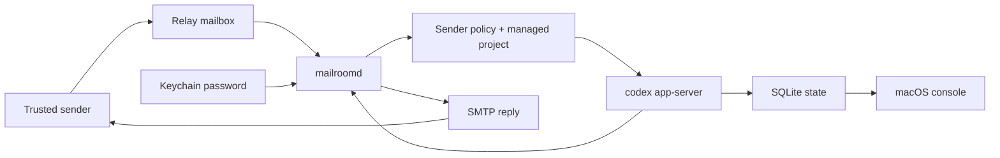

# Patch Courier

[](https://github.com/owenshen0907/patch-courier/actions/workflows/build.yml)
[](LICENSE)

**Language / 语言 / 言語:** [中文](README.md) | [English](README.en.md) | [日本語](README.ja.md)

## 日本語

Patch Courier は、信頼済みのメールスレッドをローカルの Codex 作業に変換し、どこにいてもコーディングを続けられるようにします。
メールは人間が見る入口、承認、通知チャネルとして使い、実行は `codex app-server` 経由であなたの Mac 上に残します。そのため、リポジトリアクセス、認証情報、ポリシー判断はローカルに保持されます。

### プロジェクト状況

Patch Courier は、まだ初期段階の daemon-first macOS プロトタイプです。実験やローカル operator ワークフローには使えますが、公開 API、ストレージ schema、onboarding flow は pre-1.0 として扱ってください。

### 現在できること

- `MailroomDaemon` / `mailroomd` は stdio JSON-RPC 経由でネイティブの `codex app-server` を起動します。
- Patch Courier は app-scoped な `CODEX_HOME` を用意し、operator profile から必要最小限の Codex profile artifacts を取り込むことで、ネイティブ turn が同じ provider/auth setup を使えるようにします。
- thread records、approval requests、raw event logs は、デフォルトで `~/Library/Application Support/PatchCourier/mailroom.sqlite3` の SQLite に永続化されます。
- turn records も同じ SQLite store に永続化され、origin、最新の lifecycle state、すでに通知済みの last mail outcome を含みます。
- mailbox sync cursors、mailbox accounts、sender policies も同じ SQLite store に保存され、mailbox passwords は引き続き Keychain に残ります。
- SQLite schema の互換性は `PRAGMA user_version` で追跡します。移行ポリシーは `docs/STORAGE_MIGRATIONS.md` を参照してください。
- `mailroomd` は one-shot mailbox sync と長時間動作する mail loop の両方を実行できます。mail loop は mailbox を素早くポーリングし、作業を thread ごとの background worker に分配し、completion / approval emails を返信します。
- 長時間動作する daemon は、起動時に durable mail turns を復旧し、送信済みの approval reminders を抑制し、復旧不能な active turns を永遠に待たず timed-out system errors としてマークします。
- 長時間動作する daemon は localhost JSON control plane を公開し、support root 配下に control file を発行し、live `state/read`、`approval/resolve`、daemon-owned config mutation requests に応答できます。
- macOS app は daemon control plane をポーリングして live threads / turns / approvals を表示し、mailbox / sender-policy の変更を同じ実行中の daemon session に保存します。
- daemon control snapshot には per-lane worker summaries が含まれるようになったため、macOS console はどの mailbox worker が動作中か、どの message を処理中か、backlog が溜まっているかを表示できます。
- daemon control snapshot には per-mailbox poll health も含まれます。operator は password readiness、next poll timing、sync cursor progress、recent transport failures を downstream worker execution state と分けて確認できます。

### 現在のアーキテクチャ分割

- `Runtime/` typed Codex App Server transport と Mailroom domain models
- `Daemon/` daemon bootstrap、SQLite store、approval email codec、CLI probes
- `Shared/` 既存の macOS console と mailbox workflow prototype
- `docs/TARGET_ARCHITECTURE.md` daemon-first design の target blueprint

### この方向性の理由

目標プロダクトは、次を実現するネイティブ macOS mail operator です。

- 承認済みの inbound email requests を受け取る
- 可能な限り、1 つの mail thread を 1 つの Codex thread に対応付ける
- mailbox state と approvals が daemon にあるため、UI restart に耐える
- approval requests や completion summaries を email で返す

プロービングで見つかった重要なランタイム要件は、`codex app-server` が thread を確実に作成するには書き込み可能な `CODEX_HOME` が必要である一方、実際の turns には operator の Codex provider/auth profile も必要だという点です。そのため Patch Courier は自分の runtime directory を所有しつつ、選択された source Codex home から `config.toml`、`.env`、auth metadata など少数の profile files をミラーリングします。

### 前提条件

- Xcode command line tools がインストールされた macOS。
- `PATH` 上で利用できる `xcodegen`。
- ローカルに Codex CLI がインストールされ、`codex app-server` が利用できること。
- `~/.codex` に有効な Codex profile があること、または `MAILROOM_CODEX_PROFILE_HOME` で別ディレクトリを指定できること。

### 初回実行: ローカル Probe

この手順は、実際の mailbox を設定せずに daemon と Codex bridge を検証します。

```bash
git clone https://github.com/owenshen0907/patch-courier.git
cd patch-courier
cp .env.local-probe.example .env.local
set -a; source .env.local; set +a

xcodegen generate
DERIVED_DATA_PATH="$PWD/build/DerivedData"
xcodebuild -project PatchCourier.xcodeproj \
  -scheme MailroomDaemon \
  -destination 'platform=macOS' \
  -derivedDataPath "$DERIVED_DATA_PATH" \
  CODE_SIGNING_ALLOWED=NO \
  build

MAILROOMD="$DERIVED_DATA_PATH/Build/Products/Debug/mailroomd"
"$MAILROOMD" --help
"$MAILROOMD" --probe-codex
"$MAILROOMD" --probe-turn --prompt "Reply with exactly hello and nothing else."
```

期待される結果:

- `--probe-codex` は support paths、platform info、Codex thread id を含む JSON を出力します。
- `--probe-turn` は実際の Codex turn を開始し、Codex が approval を求める、またはローカルで失敗する場合を除いて completed outcome を返します。
- `.env.local-probe.example` が repo-local な `MAILROOM_SUPPORT_ROOT` を設定するため、ローカル probe の状態は `.local/support` 配下に残ります。

どちらかの probe が失敗した場合は、コードを変更する前に `docs/TROUBLESHOOTING.md` から確認してください。

### メール Fixture のレンダリング

代表的な outbound emails をローカルでレンダリングし、subject lines、inbox preview text、HTML layout、plain-text fallbacks を確認します。

```bash
./scripts/render_mail_previews.sh
open .preview/mailroom-emails/index.html
```

このスクリプトは `mailroomd` をビルドし、サンプル daemon emails をレンダリングし、デフォルトで `.preview/mailroom-emails` 配下に `index.html` と各 message の `.html` / `.txt` ファイルを書き込みます。現在の fixture set は、即時受領、first-contact decision、managed-project selection、approval request、successful completion、failure、rejected request、saved-for-later、runtime sender confirmation をカバーしています。

### ローカル Thread の開始

ローカル probe が成功したら、email transport なしで stored Mailroom thread を実行します。

```bash
"$MAILROOMD" --start-thread \
  --sender you@example.com \
  --subject "Repo check" \
  --workspace "$PWD" \
  --prompt "Inspect the workspace and summarize the project structure." \
  --wait

"$MAILROOMD" --list-threads
"$MAILROOMD" --list-turns
"$MAILROOMD" --list-events
```

既存の stored mail thread を継続するには、`--continue-thread --token MRM-... --prompt "..." --wait` を使います。

### Mailbox を有効にする設定

Mailbox polling は実際のプロダクト loop です。ローカル probe が動作してから設定してください。

1. mailbox profile をコピーし、パスを調整します。

   ```bash
   cp .env.mailbox.example .env.local
   set -a; source .env.local; set +a
   ```

2. macOS app をビルドして起動します。

   ```bash
   DERIVED_DATA_PATH="${DERIVED_DATA_PATH:-$PWD/build/DerivedData}"
   xcodebuild -project PatchCourier.xcodeproj \
     -scheme PatchCourierMac \
     -destination 'platform=macOS' \
     -derivedDataPath "$DERIVED_DATA_PATH" \
     CODE_SIGNING_ALLOWED=NO \
     build
   MAILROOMD="$DERIVED_DATA_PATH/Build/Products/Debug/mailroomd"
   open "$DERIVED_DATA_PATH/Build/Products/Debug/Patch Courier.app"
   ```

3. app で setup を開き、次の 3 領域を設定します。

   - **Mailboxes**: relay mailbox address、IMAP endpoint、SMTP endpoint、polling interval、workspace root、app password。パスワードは `.env.local` ではなく Keychain/cached secret storage に保存されます。
   - **Sender policies**: trusted sender address、role、allowed workspace roots、first reply token が必要かどうか。
   - **Projects**: managed local project display name、slug、root path、summary、default capability。

   正確な項目、安全なデフォルト、smoke-test email は `docs/CONFIGURATION_WALKTHROUGH.md` を参照してください。macOS app も空の inbox と Settings sidebar に、同じ手順を first-run checklist として表示します。

4. app から daemon を起動するか、直接実行します。

   ```bash
   "$MAILROOMD" --run-mail-loop
   ```

5. allowed sender から relay mailbox にテストメールを送ります。最初の応答は、受領確認、sender confirmation、project selection、approval request、または final result のいずれかになるはずです。

長時間動作する loop ではなく、1 回だけ mailbox pass を実行する場合:

```bash
"$MAILROOMD" --sync-mailboxes
```

### EvoMap タスク引き渡し

Patch Courier は通常の mailbox loop 経由で、EvomapConsole から EvoMap bounty work を受け取れます。これにより 2 つの app は疎結合のままになります。EvomapConsole は EvoMap official APIs を扱い、Patch Courier はローカル Codex 作業を実行して email で返信します。

推奨設定:

1. `EvoMap Tasks` という名前、`evomap-tasks` という slug の managed project を作成します。専用のローカル workspace、たとえば `~/Workspace/evomap-tasks` を指定します。
2. EvomapConsole の送信 mailbox に sender policy を追加します。EvoMap Tasks workspace root を許可し、この専用 automation sender だけ first-contact reply-token confirmation を無効にします。
3. EvomapConsole の `Settings -> Patch Courier` で relay mailbox と同じ project slug を設定します。
4. EvomapConsole で先に bounty を claim してから、生成された `EVOMAP_EXECUTE` email を送信します。状態確認には `EVOMAP_STATUS` emails を使います。

Execute email format:

```text
PATCH_COURIER_COMMAND: EVOMAP_EXECUTE
PATCH_COURIER_PROTOCOL: 1
REQUEST_ID: evomap:<task_id>
TASK_ID: <task_id>
PROJECT: evomap-tasks
MODE: draft
AUTO_SUBMIT_ALLOWED: false
LANGUAGE: zh-Hans

<task payload>
```

Status email format:

```text
PATCH_COURIER_COMMAND: EVOMAP_STATUS
PATCH_COURIER_PROTOCOL: 1
REQUEST_ID: evomap:<task_id>
TASK_ID: <task_id>
PROJECT: evomap-tasks
```

Patch Courier は意図的に structured draft result のみを返し、EvoMap publish、complete、claim、settlement APIs は呼び出しません。最終提出は EvomapConsole に残るため、operator は node credentials を消費する前に回答を確認できます。

### アーキテクチャ概要



より詳しい説明は `docs/ARCHITECTURE_OVERVIEW.md` を参照してください。

### Daemon コマンド

`mailroomd` は native app-server probes、local stored-thread commands、mailbox-facing sync commands を提供します。

```bash
"$MAILROOMD" --probe-codex
"$MAILROOMD" --probe-turn --prompt "Reply with exactly hello and nothing else."
"$MAILROOMD" --once
"$MAILROOMD" --list-threads
"$MAILROOMD" --list-turns
"$MAILROOMD" --list-approvals
"$MAILROOMD" --list-events
"$MAILROOMD" --render-mail-fixtures --output-dir /tmp/mailroom-email-fixtures
"$MAILROOMD" --sync-mailboxes
"$MAILROOMD" --run-mail-loop
"$MAILROOMD" --start-thread --sender you@example.com --subject "Repo check" --workspace /path/to/workspace --prompt "Inspect the workspace and tell me what changed." --wait
"$MAILROOMD" --continue-thread --token MRM-1234ABCD --prompt "Continue with the next step." --wait
"$MAILROOMD" --parse-approval-file /path/to/reply.txt
```

`--probe-turn` は native app-server smoke test です。実際の thread を開始し、実際の turn を実行して完了を待ちます。`--wait` は stored Mailroom threads に同じことを行い、completion、approval-needed、user-input-needed、system-error のいずれかに解決します。`--sync-mailboxes` は設定済み accounts を 1 回ポーリングします。`--run-mail-loop` は daemon を起動し続け、enqueue 後に mailbox cursors を進め、起動時に durable mail turns を reconcile し、local JSON control plane を提供し、mailbox config を SQLite に永続化し、同じ live app-server session 内で無関係な mail threads を並行実行できるようにします。

`--run-mail-loop` の起動時には loopback endpoint が表示され、`<support-root>/daemon-control.json` が書き込まれます。ネイティブ macOS app はこの control file を読み、newline-delimited JSON で daemon と通信します。そのため approvals は新しい CLI processes を起動するのではなく、live app-server thread に結び付いたままになります。

### 環境変数 Override

ローカル専用作業は `.env.local-probe.example` から、mailbox-enabled operation は `.env.mailbox.example` から始めてください。

- `CODEX_CLI_PATH`: Codex CLI bundle executable への明示パス。
- `MAILROOM_SUPPORT_ROOT`: Mailroom support files の base directory。
- `MAILROOM_DATABASE_PATH`: thread / approval / event persistence 用の SQLite file。
- `MAILROOM_CODEX_HOME`: app-owned Codex runtime directory。
- `MAILROOM_CODEX_PROFILE_HOME`: app-owned runtime home にミラーする source Codex profile。デフォルトは `~/.codex`。
- `MAILROOM_ACCOUNTS_PATH`: legacy mailbox account JSON import path。デフォルトは `<support-root>/mailbox-accounts.json`。
- `MAILROOM_POLICIES_PATH`: legacy sender policy JSON import path。デフォルトは `<support-root>/sender-policies.json`。
- `MAILROOM_TRANSPORT_SCRIPT_PATH`: インストール済み IMAP/SMTP helper script path。デフォルトは `<support-root>/runtime-tools/mail_transport.py`。
- `MAILROOM_WORKDIR`: Codex を spawn するときに使う process working directory。
- `MAILROOM_WORKSPACE_ROOT`: probes と bootstrap commands 用の default workspace root。
- `MAILROOM_ACTIVE_TURN_RECOVERY_POLL_SECONDS`: 再起動された active turns の polling interval。デフォルトは `30`。
- `MAILROOM_ACTIVE_TURN_RECOVERY_TIMEOUT_SECONDS`: recovery が system-error timeout を記録するまでの最大 active-turn age。デフォルトは `21600`。

### 検証

```bash
cd /path/to/patch-courier
xcodegen generate
xcodebuild -project PatchCourier.xcodeproj -scheme MailroomDaemon -destination 'platform=macOS' CODE_SIGNING_ALLOWED=NO test
xcodebuild -project PatchCourier.xcodeproj -scheme MailroomDaemon -destination 'platform=macOS' -derivedDataPath /tmp/PatchCourierDerived CODE_SIGNING_ALLOWED=NO build
xcodebuild -project PatchCourier.xcodeproj -scheme PatchCourierMac -destination 'platform=macOS' -derivedDataPath /tmp/PatchCourierDerived CODE_SIGNING_ALLOWED=NO build
```

### トラブルシューティング

一般的なセットアップ失敗は `docs/TROUBLESHOOTING.md` に記録されています。Codex discovery、`CODEX_HOME` mirroring、Keychain password storage、IMAP/SMTP errors、daemon control-file issues、SQLite schema-version failures はまずここから確認してください。

### ロードマップ

次の iteration plan は `docs/ROADMAP.md` にあります。短くまとめると次の通りです。

1. Reliability and recovery は `docs/releases/v0.2.0.md` で追跡しています。
2. v0.3 は first-run setup と contributor documentation に集中します。
3. v0.4 は approvals、replay、artifacts、mailbox health の operator controls を拡張します。
4. v0.6 は core loop が安定した後に signed releases をパッケージします。

### ドキュメント

- `docs/ROADMAP.md`
- `docs/ARCHITECTURE_OVERVIEW.md`
- `docs/CONFIGURATION_WALKTHROUGH.md`
- `docs/TROUBLESHOOTING.md`
- `docs/STORAGE_MIGRATIONS.md`
- `docs/BRAND.md`
- `docs/TARGET_ARCHITECTURE.md`
- `docs/PLAN.md`
- `docs/DESIGN.md`
- `docs/releases/v0.1.0.md`
- `docs/releases/v0.2.0.md`
