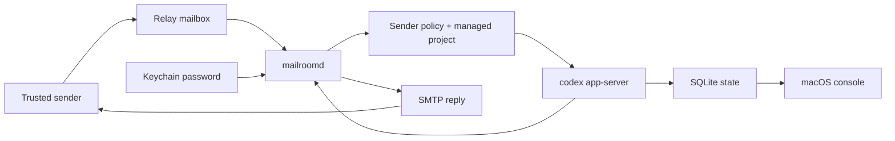

# Patch Courier

[](https://github.com/owenshen0907/patch-courier/actions/workflows/build.yml)
[](LICENSE)

**Language / 语言 / 言語:** [中文](README.md) | [English](README.en.md) | [日本語](README.ja.md)

## 中文

Patch Courier 让你可以从任何地方继续写代码：它把可信邮件线程转换成本机 Codex 任务。
邮件负责人类可见的入口、审批和通知；执行仍留在你的 Mac 上，通过 `codex app-server` 完成，因此仓库访问、凭据和策略决策都保持在本地。

### 项目状态

Patch Courier 目前是一个早期的 daemon-first macOS 原型。它适合实验和本地 operator 工作流，但公开 API、存储 schema 和 onboarding 流程仍应按 pre-1.0 对待。

### 当前已有能力

- `MailroomDaemon` / `mailroomd` 通过 stdio JSON-RPC 启动原生 `codex app-server`。
- Patch Courier 会创建 app 作用域的 `CODEX_HOME`，并从 operator profile 中拷贝原生 turn 所需的最小 Codex profile artifacts，让原生 turn 继续使用同一套 provider/auth 配置。
- thread records、approval requests 和 raw event logs 默认持久化到 SQLite：`~/Library/Application Support/PatchCourier/mailroom.sqlite3`。
- turn records 也持久化在同一个 SQLite store 中，包括来源、最新生命周期状态，以及已经通知过的最近一次邮件结果。
- mailbox sync cursors、mailbox accounts 和 sender policies 现在也保存在同一个 SQLite store 中，mailbox passwords 仍保存在 Keychain。
- SQLite schema 兼容性通过 `PRAGMA user_version` 跟踪；迁移策略见 `docs/STORAGE_MIGRATIONS.md`。
- `mailroomd` 可以执行一次性 mailbox sync，也可以运行长驻 mail loop：快速轮询邮箱、把任务分发给每个 thread 的后台 worker，并通过邮件回发 completion / approval。
- 长驻 daemon 现在会在启动时恢复 durable mail turns、抑制已经发送过的 approval reminders，并把无法恢复的 active turns 标记为 timed-out system errors，而不是无限等待。
- 长驻 daemon 现在暴露 localhost JSON control plane，在 support root 下发布 control file，并可响应 live `state/read`、`approval/resolve` 和 daemon-owned config mutation requests。
- macOS app 会轮询 daemon control plane，展示实时 threads / turns / approvals，并把 mailbox / sender-policy 变更保存到同一个运行中的 daemon session。
- daemon control snapshot 现在包含每个 lane 的 worker 摘要，因此 macOS console 可以显示哪个 mailbox worker 正在运行、正在处理哪封 message，以及 backlog 是否在累积。
- daemon control snapshot 还包含每个 mailbox 的 poll health，operator 可以分别查看 password readiness、next poll timing、sync cursor progress，以及最近的 transport failures，而不必与 downstream worker execution state 混在一起。

### 当前架构拆分

- `Runtime/` typed Codex App Server transport 和 Mailroom domain models
- `Daemon/` daemon bootstrap、SQLite store、approval email codec 和 CLI probes
- `Shared/` 现有 macOS console 与 mailbox workflow prototype
- `docs/TARGET_ARCHITECTURE.md` daemon-first 设计的目标蓝图

### 为什么选择这个方向

目标产品是一个原生 macOS mail operator，能够：

- 接收已授权的入站邮件请求
- 尽可能把一个 mail thread 映射到一个 Codex thread
- 因为 mailbox state 和 approvals 存在 daemon 中，所以能承受 UI 重启
- 通过 email 回发 approval requests 或 completion summaries

探测过程中发现的关键运行时细节是：`codex app-server` 需要可写的 `CODEX_HOME` 才能可靠创建 threads，但真实 turns 又需要 operator 的 Codex provider/auth profile。因此 Patch Courier 会拥有自己的 runtime directory，同时从选定的源 Codex home 镜像少量 profile files，例如 `config.toml`、`.env` 和 auth metadata。

### 前置条件

- 已安装 Xcode command line tools 的 macOS。
- `PATH` 中可用的 `xcodegen`。
- 本机已安装 Codex CLI，并且 `codex app-server` 可用。
- `~/.codex` 中有可工作的 Codex profile，或可通过 `MAILROOM_CODEX_PROFILE_HOME` 指向其他目录。

### 首次运行：本地探测

这条路径不需要配置真实邮箱，用来验证 daemon 和 Codex bridge。

```bash
git clone https://github.com/owenshen0907/patch-courier.git
cd patch-courier
cp .env.local-probe.example .env.local
set -a; source .env.local; set +a

xcodegen generate
DERIVED_DATA_PATH="$PWD/build/DerivedData"
xcodebuild -project PatchCourier.xcodeproj \
  -scheme MailroomDaemon \
  -destination 'platform=macOS' \
  -derivedDataPath "$DERIVED_DATA_PATH" \
  CODE_SIGNING_ALLOWED=NO \
  build

MAILROOMD="$DERIVED_DATA_PATH/Build/Products/Debug/mailroomd"
"$MAILROOMD" --help
"$MAILROOMD" --probe-codex
"$MAILROOMD" --probe-turn --prompt "Reply with exactly hello and nothing else."
```

预期结果：

- `--probe-codex` 输出包含 support paths、platform info 和 Codex thread id 的 JSON。
- `--probe-turn` 启动一个真实 Codex turn 并返回 completed outcome，除非 Codex 要求 approval 或本地失败。
- 因为 `.env.local-probe.example` 设置了 repo-local `MAILROOM_SUPPORT_ROOT`，本地探测状态会保留在 `.local/support` 下。

如果任一 probe 失败，修改代码前请先从 `docs/TROUBLESHOOTING.md` 排查。

### 渲染邮件夹具

在本地渲染代表性的出站邮件，用于检查 subject lines、inbox preview text、HTML layout 和 plain-text fallbacks：

```bash
./scripts/render_mail_previews.sh
open .preview/mailroom-emails/index.html
```

脚本会构建 `mailroomd`、渲染示例 daemon emails，并默认在 `.preview/mailroom-emails` 下写入一个 `index.html` 以及每封邮件对应的 `.html` / `.txt` 文件。当前 fixture set 覆盖即时收件回执、首次联系人决策、managed-project 选择、approval request、成功完成、失败、拒绝请求、保存稍后处理和 runtime sender confirmation。

### 启动本地 Thread

本地 probe 成功后，可以不经过 email transport 运行一个已存储的 Mailroom thread：

```bash
"$MAILROOMD" --start-thread \
  --sender you@example.com \
  --subject "Repo check" \
  --workspace "$PWD" \
  --prompt "Inspect the workspace and summarize the project structure." \
  --wait

"$MAILROOMD" --list-threads
"$MAILROOMD" --list-turns
"$MAILROOMD" --list-events
```

使用 `--continue-thread --token MRM-... --prompt "..." --wait` 继续一个已有的 stored mail thread。

### 启用邮箱的设置

Mailbox polling 是真实产品循环。请先完成本地 probe 路径，再配置邮箱。

1. 复制 mailbox profile 并调整路径：

   ```bash
   cp .env.mailbox.example .env.local
   set -a; source .env.local; set +a
   ```

2. 构建并启动 macOS app：

   ```bash
   DERIVED_DATA_PATH="${DERIVED_DATA_PATH:-$PWD/build/DerivedData}"
   xcodebuild -project PatchCourier.xcodeproj \
     -scheme PatchCourierMac \
     -destination 'platform=macOS' \
     -derivedDataPath "$DERIVED_DATA_PATH" \
     CODE_SIGNING_ALLOWED=NO \
     build
   MAILROOMD="$DERIVED_DATA_PATH/Build/Products/Debug/mailroomd"
   open "$DERIVED_DATA_PATH/Build/Products/Debug/Patch Courier.app"
   ```

3. 在 app 中打开 setup，并配置这三块：

   - **Mailboxes**：relay mailbox address、IMAP endpoint、SMTP endpoint、polling interval、workspace root 和 app password。密码通过 Keychain/cached secret storage 保存，不写入 `.env.local`。
   - **Sender policies**：trusted sender address、role、allowed workspace roots，以及是否要求首次 reply token。
   - **Projects**：managed local project display name、slug、root path、summary 和 default capability。

   具体字段、安全默认值和 smoke-test email 见 `docs/CONFIGURATION_WALKTHROUGH.md`。macOS app 也在空 inbox 和 Settings sidebar 中以 first-run checklist 的形式镜像同一路径。

4. 从 app 启动 daemon，或直接运行：

   ```bash
   "$MAILROOMD" --run-mail-loop
   ```

5. 从 allowed sender 给 relay mailbox 发送测试邮件。第一封响应应该是收件确认、sender confirmation、project selection、approval request 或 final result 中的一种。

如果只想跑一次 mailbox pass，而不是长驻 loop：

```bash
"$MAILROOMD" --sync-mailboxes
```

### EvoMap 任务交接

Patch Courier 可以通过正常 mailbox loop 接收来自 EvomapConsole 的 EvoMap bounty work。这样两个 app 保持解耦：EvomapConsole 负责 EvoMap 官方 API，Patch Courier 负责本地 Codex 工作并通过 email 回复。

推荐设置：

1. 创建名为 `EvoMap Tasks`、slug 为 `evomap-tasks` 的 managed project。将其指向一个专用本地 workspace，例如 `~/Workspace/evomap-tasks`。
2. 为 EvomapConsole 的发送邮箱添加 sender policy。允许 EvoMap Tasks workspace root，并且仅对这个专用 automation sender 关闭 first-contact reply-token confirmation。
3. 在 EvomapConsole 的 `Settings -> Patch Courier` 中配置 relay mailbox 和相同的 project slug。
4. 先在 EvomapConsole 中 claim bounty，然后发送生成的 `EVOMAP_EXECUTE` email。使用 `EVOMAP_STATUS` emails 查询状态。

Execute email format：

```text
PATCH_COURIER_COMMAND: EVOMAP_EXECUTE
PATCH_COURIER_PROTOCOL: 1
REQUEST_ID: evomap:<task_id>
TASK_ID: <task_id>
PROJECT: evomap-tasks
MODE: draft
AUTO_SUBMIT_ALLOWED: false
LANGUAGE: zh-Hans

<task payload>
```

Status email format：

```text
PATCH_COURIER_COMMAND: EVOMAP_STATUS
PATCH_COURIER_PROTOCOL: 1
REQUEST_ID: evomap:<task_id>
TASK_ID: <task_id>
PROJECT: evomap-tasks
```

Patch Courier 会刻意只返回结构化 draft result，不调用 EvoMap publish、complete、claim 或 settlement APIs。最终提交仍留在 EvomapConsole 中，让 operator 在消耗 node credentials 前先审阅答案。

### 架构一览



更完整版本见 `docs/ARCHITECTURE_OVERVIEW.md`。

### Daemon 命令

`mailroomd` 暴露原生 app-server probes、本地 stored-thread commands 和 mailbox-facing sync commands：

```bash
"$MAILROOMD" --probe-codex
"$MAILROOMD" --probe-turn --prompt "Reply with exactly hello and nothing else."
"$MAILROOMD" --once
"$MAILROOMD" --list-threads
"$MAILROOMD" --list-turns
"$MAILROOMD" --list-approvals
"$MAILROOMD" --list-events
"$MAILROOMD" --render-mail-fixtures --output-dir /tmp/mailroom-email-fixtures
"$MAILROOMD" --sync-mailboxes
"$MAILROOMD" --run-mail-loop
"$MAILROOMD" --start-thread --sender you@example.com --subject "Repo check" --workspace /path/to/workspace --prompt "Inspect the workspace and tell me what changed." --wait
"$MAILROOMD" --continue-thread --token MRM-1234ABCD --prompt "Continue with the next step." --wait
"$MAILROOMD" --parse-approval-file /path/to/reply.txt
```

`--probe-turn` 是原生 app-server smoke test：它会启动真实 thread、执行真实 turn，并等待完成。`--wait` 对 stored Mailroom threads 做同样的事，最终解析为 completion、approval-needed、user-input-needed 或 system-error 状态。`--sync-mailboxes` 对已配置 accounts 执行一次 polling pass；`--run-mail-loop` 让 daemon 保持运行，在 enqueue 后推进 mailbox cursors，启动时 reconcile durable mail turns，提供本地 JSON control plane，把 mailbox config 持久化到 SQLite，并让同一个 live app-server session 中的不相关 mail threads 并发执行。

`--run-mail-loop` 启动时会打印 loopback endpoint，并写入 `<support-root>/daemon-control.json`。原生 macOS app 读取这个 control file，并通过 newline-delimited JSON 与 daemon 通信，因此 approvals 会继续绑定在 live app-server thread 上，而不是启动新的 CLI processes。

### 环境变量覆盖

本地-only 工作请从 `.env.local-probe.example` 开始；启用 mailbox 的运行请从 `.env.mailbox.example` 开始。

- `CODEX_CLI_PATH`：Codex CLI bundle executable 的显式路径。
- `MAILROOM_SUPPORT_ROOT`：Mailroom support files 的基目录。
- `MAILROOM_DATABASE_PATH`：thread / approval / event persistence 使用的 SQLite file。
- `MAILROOM_CODEX_HOME`：app-owned Codex runtime directory。
- `MAILROOM_CODEX_PROFILE_HOME`：镜像到 app-owned runtime home 的源 Codex profile，默认 `~/.codex`。
- `MAILROOM_ACCOUNTS_PATH`：legacy mailbox account JSON import path，默认 `<support-root>/mailbox-accounts.json`。
- `MAILROOM_POLICIES_PATH`：legacy sender policy JSON import path，默认 `<support-root>/sender-policies.json`。
- `MAILROOM_TRANSPORT_SCRIPT_PATH`：已安装 IMAP/SMTP helper script path，默认 `<support-root>/runtime-tools/mail_transport.py`。
- `MAILROOM_WORKDIR`：spawn Codex 时使用的 process working directory。
- `MAILROOM_WORKSPACE_ROOT`：probes 和 bootstrap commands 使用的默认 workspace root。
- `MAILROOM_ACTIVE_TURN_RECOVERY_POLL_SECONDS`：重启后 active turns 的 polling interval，默认 `30`。
- `MAILROOM_ACTIVE_TURN_RECOVERY_TIMEOUT_SECONDS`：active-turn age 上限，超过后 recovery 记录 system-error timeout，默认 `21600`。

### 验证

```bash
cd /path/to/patch-courier
xcodegen generate
xcodebuild -project PatchCourier.xcodeproj -scheme MailroomDaemon -destination 'platform=macOS' CODE_SIGNING_ALLOWED=NO test
xcodebuild -project PatchCourier.xcodeproj -scheme MailroomDaemon -destination 'platform=macOS' -derivedDataPath /tmp/PatchCourierDerived CODE_SIGNING_ALLOWED=NO build
xcodebuild -project PatchCourier.xcodeproj -scheme PatchCourierMac -destination 'platform=macOS' -derivedDataPath /tmp/PatchCourierDerived CODE_SIGNING_ALLOWED=NO build
```

### 故障排查

常见设置失败记录在 `docs/TROUBLESHOOTING.md`。Codex discovery、`CODEX_HOME` mirroring、Keychain password storage、IMAP/SMTP errors、daemon control-file issues 和 SQLite schema-version failures 都建议先从这里排查。

### 路线图

下一轮迭代计划位于 `docs/ROADMAP.md`。简版如下：

1. Reliability and recovery 追踪在 `docs/releases/v0.2.0.md`。
2. v0.3 聚焦 first-run setup 和 contributor documentation。
3. v0.4 扩展 approvals、replay、artifacts 和 mailbox health 的 operator controls。
4. v0.6 会在 core loop 稳定后打包 signed releases。

### 文档

- `docs/ROADMAP.md`
- `docs/ARCHITECTURE_OVERVIEW.md`
- `docs/CONFIGURATION_WALKTHROUGH.md`
- `docs/TROUBLESHOOTING.md`
- `docs/STORAGE_MIGRATIONS.md`
- `docs/BRAND.md`
- `docs/TARGET_ARCHITECTURE.md`
- `docs/PLAN.md`
- `docs/DESIGN.md`
- `docs/releases/v0.1.0.md`
- `docs/releases/v0.2.0.md`
