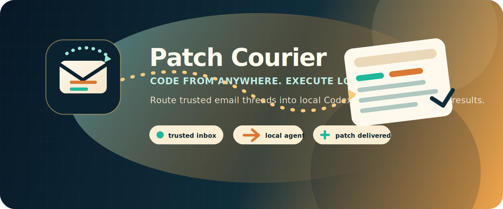
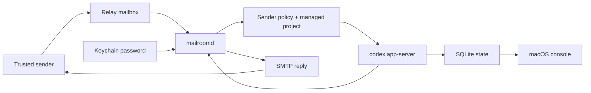

# Patch Courier

[](https://github.com/owenshen0907/patch-courier/actions/workflows/build.yml)
[](LICENSE)

## Language / 语言 / 言語

- [中文](#中文)
- [English](#english)
- [日本語](#日本語)

---

## 中文

Patch Courier 让你可以从任何地方继续写代码：它把可信邮件线程转换成本机 Codex 任务。
邮件负责人类可见的入口、审批和通知；执行仍留在你的 Mac 上，通过 `codex app-server` 完成，因此仓库访问、凭据和策略决策都保持在本地。

### 项目状态

Patch Courier 目前是一个早期的 daemon-first macOS 原型。它适合实验和本地 operator 工作流，但公开 API、存储 schema 和 onboarding 流程仍应按 pre-1.0 对待。

### 当前已有能力

- `MailroomDaemon` / `mailroomd` 通过 stdio JSON-RPC 启动原生 `codex app-server`。
- Patch Courier 会创建 app 作用域的 `CODEX_HOME`，并从 operator profile 中拷贝原生 turn 所需的最小 Codex profile artifacts，让原生 turn 继续使用同一套 provider/auth 配置。
- thread records、approval requests 和 raw event logs 默认持久化到 SQLite：`~/Library/Application Support/PatchCourier/mailroom.sqlite3`。
- turn records 也持久化在同一个 SQLite store 中，包括来源、最新生命周期状态，以及已经通知过的最近一次邮件结果。
- mailbox sync cursors、mailbox accounts 和 sender policies 现在也保存在同一个 SQLite store 中，mailbox passwords 仍保存在 Keychain。
- SQLite schema 兼容性通过 `PRAGMA user_version` 跟踪；迁移策略见 `docs/STORAGE_MIGRATIONS.md`。
- `mailroomd` 可以执行一次性 mailbox sync，也可以运行长驻 mail loop：快速轮询邮箱、把任务分发给每个 thread 的后台 worker，并通过邮件回发 completion / approval。
- 长驻 daemon 现在会在启动时恢复 durable mail turns、抑制已经发送过的 approval reminders，并把无法恢复的 active turns 标记为 timed-out system errors，而不是无限等待。
- 长驻 daemon 现在暴露 localhost JSON control plane，在 support root 下发布 control file，并可响应 live `state/read`、`approval/resolve` 和 daemon-owned config mutation requests。
- macOS app 会轮询 daemon control plane，展示实时 threads / turns / approvals，并把 mailbox / sender-policy 变更保存到同一个运行中的 daemon session。
- daemon control snapshot 现在包含每个 lane 的 worker 摘要，因此 macOS console 可以显示哪个 mailbox worker 正在运行、正在处理哪封 message，以及 backlog 是否在累积。
- daemon control snapshot 还包含每个 mailbox 的 poll health，operator 可以分别查看 password readiness、next poll timing、sync cursor progress，以及最近的 transport failures，而不必与 downstream worker execution state 混在一起。

### 当前架构拆分

- `Runtime/` typed Codex App Server transport 和 Mailroom domain models
- `Daemon/` daemon bootstrap、SQLite store、approval email codec 和 CLI probes
- `Shared/` 现有 macOS console 与 mailbox workflow prototype
- `docs/TARGET_ARCHITECTURE.md` daemon-first 设计的目标蓝图

### 为什么选择这个方向

目标产品是一个原生 macOS mail operator，能够：

- 接收已授权的入站邮件请求
- 尽可能把一个 mail thread 映射到一个 Codex thread
- 因为 mailbox state 和 approvals 存在 daemon 中，所以能承受 UI 重启
- 通过 email 回发 approval requests 或 completion summaries

探测过程中发现的关键运行时细节是：`codex app-server` 需要可写的 `CODEX_HOME` 才能可靠创建 threads，但真实 turns 又需要 operator 的 Codex provider/auth profile。因此 Patch Courier 会拥有自己的 runtime directory，同时从选定的源 Codex home 镜像少量 profile files，例如 `config.toml`、`.env` 和 auth metadata。

### 前置条件

- 已安装 Xcode command line tools 的 macOS。
- `PATH` 中可用的 `xcodegen`。
- 本机已安装 Codex CLI，并且 `codex app-server` 可用。
- `~/.codex` 中有可工作的 Codex profile，或可通过 `MAILROOM_CODEX_PROFILE_HOME` 指向其他目录。

### 首次运行：本地探测

这条路径不需要配置真实邮箱，用来验证 daemon 和 Codex bridge。

```bash
git clone https://github.com/owenshen0907/patch-courier.git
cd patch-courier
cp .env.local-probe.example .env.local
set -a; source .env.local; set +a

xcodegen generate
DERIVED_DATA_PATH="$PWD/build/DerivedData"
xcodebuild -project PatchCourier.xcodeproj \
  -scheme MailroomDaemon \
  -destination 'platform=macOS' \
  -derivedDataPath "$DERIVED_DATA_PATH" \
  CODE_SIGNING_ALLOWED=NO \
  build

MAILROOMD="$DERIVED_DATA_PATH/Build/Products/Debug/mailroomd"
"$MAILROOMD" --help
"$MAILROOMD" --probe-codex
"$MAILROOMD" --probe-turn --prompt "Reply with exactly hello and nothing else."
```

预期结果：

- `--probe-codex` 输出包含 support paths、platform info 和 Codex thread id 的 JSON。
- `--probe-turn` 启动一个真实 Codex turn 并返回 completed outcome，除非 Codex 要求 approval 或本地失败。
- 因为 `.env.local-probe.example` 设置了 repo-local `MAILROOM_SUPPORT_ROOT`，本地探测状态会保留在 `.local/support` 下。

如果任一 probe 失败，修改代码前请先从 `docs/TROUBLESHOOTING.md` 排查。

### 渲染邮件夹具

在本地渲染代表性的出站邮件，用于检查 subject lines、inbox preview text、HTML layout 和 plain-text fallbacks：

```bash
./scripts/render_mail_previews.sh
open .preview/mailroom-emails/index.html
```

脚本会构建 `mailroomd`、渲染示例 daemon emails，并默认在 `.preview/mailroom-emails` 下写入一个 `index.html` 以及每封邮件对应的 `.html` / `.txt` 文件。当前 fixture set 覆盖即时收件回执、首次联系人决策、managed-project 选择、approval request、成功完成、失败、拒绝请求、保存稍后处理和 runtime sender confirmation。

### 启动本地 Thread

本地 probe 成功后，可以不经过 email transport 运行一个已存储的 Mailroom thread：

```bash
"$MAILROOMD" --start-thread \
  --sender you@example.com \
  --subject "Repo check" \
  --workspace "$PWD" \
  --prompt "Inspect the workspace and summarize the project structure." \
  --wait

"$MAILROOMD" --list-threads
"$MAILROOMD" --list-turns
"$MAILROOMD" --list-events
```

使用 `--continue-thread --token MRM-... --prompt "..." --wait` 继续一个已有的 stored mail thread。

### 启用邮箱的设置

Mailbox polling 是真实产品循环。请先完成本地 probe 路径，再配置邮箱。

1. 复制 mailbox profile 并调整路径：

   ```bash
   cp .env.mailbox.example .env.local
   set -a; source .env.local; set +a
   ```

2. 构建并启动 macOS app：

   ```bash
   DERIVED_DATA_PATH="${DERIVED_DATA_PATH:-$PWD/build/DerivedData}"
   xcodebuild -project PatchCourier.xcodeproj \
     -scheme PatchCourierMac \
     -destination 'platform=macOS' \
     -derivedDataPath "$DERIVED_DATA_PATH" \
     CODE_SIGNING_ALLOWED=NO \
     build
   MAILROOMD="$DERIVED_DATA_PATH/Build/Products/Debug/mailroomd"
   open "$DERIVED_DATA_PATH/Build/Products/Debug/Patch Courier.app"
   ```

3. 在 app 中打开 setup，并配置这三块：

   - **Mailboxes**：relay mailbox address、IMAP endpoint、SMTP endpoint、polling interval、workspace root 和 app password。密码通过 Keychain/cached secret storage 保存，不写入 `.env.local`。
   - **Sender policies**：trusted sender address、role、allowed workspace roots，以及是否要求首次 reply token。
   - **Projects**：managed local project display name、slug、root path、summary 和 default capability。

   具体字段、安全默认值和 smoke-test email 见 `docs/CONFIGURATION_WALKTHROUGH.md`。macOS app 也在空 inbox 和 Settings sidebar 中以 first-run checklist 的形式镜像同一路径。

4. 从 app 启动 daemon，或直接运行：

   ```bash
   "$MAILROOMD" --run-mail-loop
   ```

5. 从 allowed sender 给 relay mailbox 发送测试邮件。第一封响应应该是收件确认、sender confirmation、project selection、approval request 或 final result 中的一种。

如果只想跑一次 mailbox pass，而不是长驻 loop：

```bash
"$MAILROOMD" --sync-mailboxes
```

### EvoMap 任务交接

Patch Courier 可以通过正常 mailbox loop 接收来自 EvomapConsole 的 EvoMap bounty work。这样两个 app 保持解耦：EvomapConsole 负责 EvoMap 官方 API，Patch Courier 负责本地 Codex 工作并通过 email 回复。

推荐设置：

1. 创建名为 `EvoMap Tasks`、slug 为 `evomap-tasks` 的 managed project。将其指向一个专用本地 workspace，例如 `~/Workspace/evomap-tasks`。
2. 为 EvomapConsole 的发送邮箱添加 sender policy。允许 EvoMap Tasks workspace root，并且仅对这个专用 automation sender 关闭 first-contact reply-token confirmation。
3. 在 EvomapConsole 的 `Settings -> Patch Courier` 中配置 relay mailbox 和相同的 project slug。
4. 先在 EvomapConsole 中 claim bounty，然后发送生成的 `EVOMAP_EXECUTE` email。使用 `EVOMAP_STATUS` emails 查询状态。

Execute email format：

```text
PATCH_COURIER_COMMAND: EVOMAP_EXECUTE
PATCH_COURIER_PROTOCOL: 1
REQUEST_ID: evomap:<task_id>
TASK_ID: <task_id>
PROJECT: evomap-tasks
MODE: draft
AUTO_SUBMIT_ALLOWED: false
LANGUAGE: zh-Hans

<task payload>
```

Status email format：

```text
PATCH_COURIER_COMMAND: EVOMAP_STATUS
PATCH_COURIER_PROTOCOL: 1
REQUEST_ID: evomap:<task_id>
TASK_ID: <task_id>
PROJECT: evomap-tasks
```

Patch Courier 会刻意只返回结构化 draft result，不调用 EvoMap publish、complete、claim 或 settlement APIs。最终提交仍留在 EvomapConsole 中，让 operator 在消耗 node credentials 前先审阅答案。

### 架构一览



更完整版本见 `docs/ARCHITECTURE_OVERVIEW.md`。

### Daemon 命令

`mailroomd` 暴露原生 app-server probes、本地 stored-thread commands 和 mailbox-facing sync commands：

```bash
"$MAILROOMD" --probe-codex
"$MAILROOMD" --probe-turn --prompt "Reply with exactly hello and nothing else."
"$MAILROOMD" --once
"$MAILROOMD" --list-threads
"$MAILROOMD" --list-turns
"$MAILROOMD" --list-approvals
"$MAILROOMD" --list-events
"$MAILROOMD" --render-mail-fixtures --output-dir /tmp/mailroom-email-fixtures
"$MAILROOMD" --sync-mailboxes
"$MAILROOMD" --run-mail-loop
"$MAILROOMD" --start-thread --sender you@example.com --subject "Repo check" --workspace /path/to/workspace --prompt "Inspect the workspace and tell me what changed." --wait
"$MAILROOMD" --continue-thread --token MRM-1234ABCD --prompt "Continue with the next step." --wait
"$MAILROOMD" --parse-approval-file /path/to/reply.txt
```

`--probe-turn` 是原生 app-server smoke test：它会启动真实 thread、执行真实 turn，并等待完成。`--wait` 对 stored Mailroom threads 做同样的事，最终解析为 completion、approval-needed、user-input-needed 或 system-error 状态。`--sync-mailboxes` 对已配置 accounts 执行一次 polling pass；`--run-mail-loop` 让 daemon 保持运行，在 enqueue 后推进 mailbox cursors，启动时 reconcile durable mail turns，提供本地 JSON control plane，把 mailbox config 持久化到 SQLite，并让同一个 live app-server session 中的不相关 mail threads 并发执行。

`--run-mail-loop` 启动时会打印 loopback endpoint，并写入 `<support-root>/daemon-control.json`。原生 macOS app 读取这个 control file，并通过 newline-delimited JSON 与 daemon 通信，因此 approvals 会继续绑定在 live app-server thread 上，而不是启动新的 CLI processes。

### 环境变量覆盖

本地-only 工作请从 `.env.local-probe.example` 开始；启用 mailbox 的运行请从 `.env.mailbox.example` 开始。

- `CODEX_CLI_PATH`：Codex CLI bundle executable 的显式路径。
- `MAILROOM_SUPPORT_ROOT`：Mailroom support files 的基目录。
- `MAILROOM_DATABASE_PATH`：thread / approval / event persistence 使用的 SQLite file。
- `MAILROOM_CODEX_HOME`：app-owned Codex runtime directory。
- `MAILROOM_CODEX_PROFILE_HOME`：镜像到 app-owned runtime home 的源 Codex profile，默认 `~/.codex`。
- `MAILROOM_ACCOUNTS_PATH`：legacy mailbox account JSON import path，默认 `<support-root>/mailbox-accounts.json`。
- `MAILROOM_POLICIES_PATH`：legacy sender policy JSON import path，默认 `<support-root>/sender-policies.json`。
- `MAILROOM_TRANSPORT_SCRIPT_PATH`：已安装 IMAP/SMTP helper script path，默认 `<support-root>/runtime-tools/mail_transport.py`。
- `MAILROOM_WORKDIR`：spawn Codex 时使用的 process working directory。
- `MAILROOM_WORKSPACE_ROOT`：probes 和 bootstrap commands 使用的默认 workspace root。
- `MAILROOM_ACTIVE_TURN_RECOVERY_POLL_SECONDS`：重启后 active turns 的 polling interval，默认 `30`。
- `MAILROOM_ACTIVE_TURN_RECOVERY_TIMEOUT_SECONDS`：active-turn age 上限，超过后 recovery 记录 system-error timeout，默认 `21600`。

### 验证

```bash
cd /path/to/patch-courier
xcodegen generate
xcodebuild -project PatchCourier.xcodeproj -scheme MailroomDaemon -destination 'platform=macOS' CODE_SIGNING_ALLOWED=NO test
xcodebuild -project PatchCourier.xcodeproj -scheme MailroomDaemon -destination 'platform=macOS' -derivedDataPath /tmp/PatchCourierDerived CODE_SIGNING_ALLOWED=NO build
xcodebuild -project PatchCourier.xcodeproj -scheme PatchCourierMac -destination 'platform=macOS' -derivedDataPath /tmp/PatchCourierDerived CODE_SIGNING_ALLOWED=NO build
```

### 故障排查

常见设置失败记录在 `docs/TROUBLESHOOTING.md`。Codex discovery、`CODEX_HOME` mirroring、Keychain password storage、IMAP/SMTP errors、daemon control-file issues 和 SQLite schema-version failures 都建议先从这里排查。

### 路线图

下一轮迭代计划位于 `docs/ROADMAP.md`。简版如下：

1. Reliability and recovery 追踪在 `docs/releases/v0.2.0.md`。
2. v0.3 聚焦 first-run setup 和 contributor documentation。
3. v0.4 扩展 approvals、replay、artifacts 和 mailbox health 的 operator controls。
4. v0.6 会在 core loop 稳定后打包 signed releases。

### 文档

- `docs/ROADMAP.md`
- `docs/ARCHITECTURE_OVERVIEW.md`
- `docs/CONFIGURATION_WALKTHROUGH.md`
- `docs/TROUBLESHOOTING.md`
- `docs/STORAGE_MIGRATIONS.md`
- `docs/BRAND.md`
- `docs/TARGET_ARCHITECTURE.md`
- `docs/PLAN.md`
- `docs/DESIGN.md`
- `docs/releases/v0.1.0.md`
- `docs/releases/v0.2.0.md`

---

## English

Patch Courier lets you keep coding from wherever you are by turning trusted email threads into local Codex work.
Email is the human-facing ingress, approval, and notification channel; execution stays on your Mac through `codex app-server`, so repository access, credentials, and policy decisions remain local.

### Project status

Patch Courier is an early, daemon-first macOS prototype. It is useful for experimentation and local operator workflows, but the public API, storage schema, and onboarding flow should still be treated as pre-1.0.

### What exists now

- `MailroomDaemon` / `mailroomd` boots native `codex app-server` over stdio JSON-RPC.
- Patch Courier provisions an app-scoped `CODEX_HOME` and seeds the minimal Codex profile artifacts it needs from the operator profile so native turns still use the same provider/auth setup.
- thread records, approval requests, and raw event logs are persisted in SQLite at `~/Library/Application Support/PatchCourier/mailroom.sqlite3` by default.
- turn records are now persisted in the same SQLite store, including origin, latest lifecycle state, and the last mail outcome already notified.
- mailbox sync cursors, mailbox accounts, and sender policies now live in the same SQLite store, while mailbox passwords remain in Keychain.
- SQLite schema compatibility is tracked with `PRAGMA user_version`; see `docs/STORAGE_MIGRATIONS.md` for the migration policy.
- `mailroomd` can now run one-shot mailbox syncs or a long-lived mail loop that polls mailboxes quickly, fans work out to per-thread background workers, and sends completion / approval emails back out.
- the long-lived daemon now performs startup recovery for durable mail turns, suppresses already-sent approval reminders, and marks unrecoverable active turns as timed-out system errors instead of waiting forever.
- the long-lived daemon now exposes a localhost JSON control plane, publishes a control file under the support root, and can answer live `state/read`, `approval/resolve`, and daemon-owned config mutation requests.
- the macOS app now polls that daemon control plane to show live threads / turns / approvals, and saves mailbox / sender-policy changes against the same running daemon session.
- the daemon control snapshot now includes per-lane worker summaries, so the macOS console can show which mailbox worker is running, what message it is handling, and whether backlog is building up behind it.
- the daemon control snapshot now also includes per-mailbox poll health, so operators can see password readiness, next poll timing, sync cursor progress, and recent transport failures separately from downstream worker execution state.

### Current architecture split

- `Runtime/` typed Codex App Server transport and Mailroom domain models
- `Daemon/` daemon bootstrap, SQLite store, approval email codec, and CLI probes
- `Shared/` existing macOS console and mailbox workflow prototype
- `docs/TARGET_ARCHITECTURE.md` target blueprint for the daemon-first design

### Why this direction

The target product is a native macOS mail operator that can:

- receive approved inbound email requests
- map one mail thread to one Codex thread when possible
- survive UI restarts because mailbox state and approvals live in a daemon
- send approval requests or completion summaries back over email

The critical runtime detail discovered during probing is that `codex app-server` needs a writable `CODEX_HOME` to create threads reliably, but real turns also need the operator's Codex provider/auth profile. Patch Courier therefore owns its runtime directory while mirroring a small set of profile files such as `config.toml`, `.env`, and auth metadata from the selected source Codex home.

### Prerequisites

- macOS with Xcode command line tools installed.
- `xcodegen` available on `PATH`.
- Codex CLI installed locally, with `codex app-server` available.
- A working Codex profile in `~/.codex` or another directory you can point to with `MAILROOM_CODEX_PROFILE_HOME`.

### First Run: Local Probe

This path verifies the daemon and Codex bridge without configuring any real mailbox.

```bash
git clone https://github.com/owenshen0907/patch-courier.git
cd patch-courier
cp .env.local-probe.example .env.local
set -a; source .env.local; set +a

xcodegen generate
DERIVED_DATA_PATH="$PWD/build/DerivedData"
xcodebuild -project PatchCourier.xcodeproj \
  -scheme MailroomDaemon \
  -destination 'platform=macOS' \
  -derivedDataPath "$DERIVED_DATA_PATH" \
  CODE_SIGNING_ALLOWED=NO \
  build

MAILROOMD="$DERIVED_DATA_PATH/Build/Products/Debug/mailroomd"
"$MAILROOMD" --help
"$MAILROOMD" --probe-codex
"$MAILROOMD" --probe-turn --prompt "Reply with exactly hello and nothing else."
```

Expected result:

- `--probe-codex` prints JSON with support paths, platform info, and a Codex thread id.
- `--probe-turn` starts a real Codex turn and returns a completed outcome, unless Codex asks for approval or fails locally.
- Local probe state stays under `.local/support` because `.env.local-probe.example` sets a repo-local `MAILROOM_SUPPORT_ROOT`.

If either probe fails, start with `docs/TROUBLESHOOTING.md` before changing code.

### Render Email Fixtures

Render representative outbound emails locally to inspect subject lines, inbox preview text, HTML layout, and plain-text fallbacks:

```bash
./scripts/render_mail_previews.sh
open .preview/mailroom-emails/index.html
```

The script builds `mailroomd`, renders sample daemon emails, and writes an `index.html` plus per-message `.html` / `.txt` files under `.preview/mailroom-emails` by default. The current fixture set covers immediate receipt, first-contact decision, managed-project selection, approval request, successful completion, failure, rejected request, saved-for-later, and runtime sender confirmation.

### Start a Local Thread

After the local probe succeeds, run a stored Mailroom thread without email transport:

```bash
"$MAILROOMD" --start-thread \
  --sender you@example.com \
  --subject "Repo check" \
  --workspace "$PWD" \
  --prompt "Inspect the workspace and summarize the project structure." \
  --wait

"$MAILROOMD" --list-threads
"$MAILROOMD" --list-turns
"$MAILROOMD" --list-events
```

Use `--continue-thread --token MRM-... --prompt "..." --wait` to continue an existing stored mail thread.

### Mailbox-Enabled Setup

Mailbox polling is the real product loop. Configure it only after the local probe path works.

1. Copy the mailbox profile and adjust paths:

   ```bash
   cp .env.mailbox.example .env.local
   set -a; source .env.local; set +a
   ```

2. Build and launch the macOS app:

   ```bash
   DERIVED_DATA_PATH="${DERIVED_DATA_PATH:-$PWD/build/DerivedData}"
   xcodebuild -project PatchCourier.xcodeproj \
     -scheme PatchCourierMac \
     -destination 'platform=macOS' \
     -derivedDataPath "$DERIVED_DATA_PATH" \
     CODE_SIGNING_ALLOWED=NO \
     build
   MAILROOMD="$DERIVED_DATA_PATH/Build/Products/Debug/mailroomd"
   open "$DERIVED_DATA_PATH/Build/Products/Debug/Patch Courier.app"
   ```

3. In the app, open setup and configure these three areas:

   - **Mailboxes**: relay mailbox address, IMAP endpoint, SMTP endpoint, polling interval, workspace root, and app password. Passwords are stored through Keychain/cached secret storage, not in `.env.local`.
   - **Sender policies**: trusted sender address, role, allowed workspace roots, and whether the first reply token is required.
   - **Projects**: managed local project display name, slug, root path, summary, and default capability.

   Use `docs/CONFIGURATION_WALKTHROUGH.md` for exact fields, safe defaults, and a smoke-test email. The macOS app mirrors the same path as a first-run checklist in the empty inbox and Settings sidebar.

4. Start the daemon from the app, or run it directly:

   ```bash
   "$MAILROOMD" --run-mail-loop
   ```

5. Send a test email from an allowed sender to the relay mailbox. The first response should either acknowledge receipt, ask for sender confirmation, ask for project selection, ask for approval, or return a final result.

For a one-shot mailbox pass instead of a long-running loop:

```bash
"$MAILROOMD" --sync-mailboxes
```

### EvoMap Task Handoff

Patch Courier can receive EvoMap bounty work from EvomapConsole over the normal mailbox loop. This keeps the two apps decoupled: EvomapConsole manages EvoMap official APIs, while Patch Courier runs local Codex work and replies by email.

Recommended setup:

1. Create a managed project named `EvoMap Tasks` with slug `evomap-tasks`. Point it at a dedicated local workspace, for example `~/Workspace/evomap-tasks`.
2. Add a sender policy for the EvomapConsole sending mailbox. Allow the EvoMap Tasks workspace root and disable first-contact reply-token confirmation only for this dedicated automation sender.
3. Configure EvomapConsole `Settings -> Patch Courier` with the relay mailbox and the same project slug.
4. In EvomapConsole, claim a bounty first, then send the generated `EVOMAP_EXECUTE` email. Use `EVOMAP_STATUS` emails for status checks.

Execute email format:

```text
PATCH_COURIER_COMMAND: EVOMAP_EXECUTE
PATCH_COURIER_PROTOCOL: 1
REQUEST_ID: evomap:<task_id>
TASK_ID: <task_id>
PROJECT: evomap-tasks
MODE: draft
AUTO_SUBMIT_ALLOWED: false
LANGUAGE: zh-Hans

<task payload>
```

Status email format:

```text
PATCH_COURIER_COMMAND: EVOMAP_STATUS
PATCH_COURIER_PROTOCOL: 1
REQUEST_ID: evomap:<task_id>
TASK_ID: <task_id>
PROJECT: evomap-tasks
```

Patch Courier deliberately returns a structured draft result and does not call EvoMap publish, complete, claim, or settlement APIs. Final submission stays in EvomapConsole so the operator can review the answer before spending node credentials.

### Architecture At A Glance


See `docs/ARCHITECTURE_OVERVIEW.md` for the longer version.

### Daemon Commands

`mailroomd` exposes native app-server probes, local stored-thread commands, and mailbox-facing sync commands:

```bash
"$MAILROOMD" --probe-codex
"$MAILROOMD" --probe-turn --prompt "Reply with exactly hello and nothing else."
"$MAILROOMD" --once
"$MAILROOMD" --list-threads
"$MAILROOMD" --list-turns
"$MAILROOMD" --list-approvals
"$MAILROOMD" --list-events
"$MAILROOMD" --render-mail-fixtures --output-dir /tmp/mailroom-email-fixtures
"$MAILROOMD" --sync-mailboxes
"$MAILROOMD" --run-mail-loop
"$MAILROOMD" --start-thread --sender you@example.com --subject "Repo check" --workspace /path/to/workspace --prompt "Inspect the workspace and tell me what changed." --wait
"$MAILROOMD" --continue-thread --token MRM-1234ABCD --prompt "Continue with the next step." --wait
"$MAILROOMD" --parse-approval-file /path/to/reply.txt
```

`--probe-turn` is the native app-server smoke test: it starts a real thread, executes a real turn, and waits for completion. `--wait` does the same for stored Mailroom threads, resolving to completion, approval-needed, user-input-needed, or system-error states. `--sync-mailboxes` performs one polling pass over configured accounts, while `--run-mail-loop` keeps the daemon alive, advances mailbox cursors after enqueue, reconciles durable mail turns on startup, serves the local JSON control plane, persists mailbox config in SQLite, and lets unrelated mail threads execute concurrently inside the same live app-server session.

When `--run-mail-loop` starts, it prints the loopback endpoint and writes `<support-root>/daemon-control.json`. The native macOS app reads that control file and talks to the daemon over newline-delimited JSON so approvals stay attached to the live app-server thread instead of spawning fresh CLI processes.

### Environment Overrides

Start with `.env.local-probe.example` for local-only work and `.env.mailbox.example` for mailbox-enabled operation.

- `CODEX_CLI_PATH`: explicit path to the Codex CLI bundle executable.
- `MAILROOM_SUPPORT_ROOT`: base directory for Mailroom support files.
- `MAILROOM_DATABASE_PATH`: SQLite file for thread / approval / event persistence.
- `MAILROOM_CODEX_HOME`: app-owned Codex runtime directory.
- `MAILROOM_CODEX_PROFILE_HOME`: source Codex profile to mirror into the app-owned runtime home, defaults to `~/.codex`.
- `MAILROOM_ACCOUNTS_PATH`: legacy mailbox account JSON import path, defaults to `<support-root>/mailbox-accounts.json`.
- `MAILROOM_POLICIES_PATH`: legacy sender policy JSON import path, defaults to `<support-root>/sender-policies.json`.
- `MAILROOM_TRANSPORT_SCRIPT_PATH`: installed IMAP/SMTP helper script path, defaults to `<support-root>/runtime-tools/mail_transport.py`.
- `MAILROOM_WORKDIR`: process working directory used when spawning Codex.
- `MAILROOM_WORKSPACE_ROOT`: default workspace root for probes and bootstrap commands.
- `MAILROOM_ACTIVE_TURN_RECOVERY_POLL_SECONDS`: polling interval for restarted active turns, defaults to `30`.
- `MAILROOM_ACTIVE_TURN_RECOVERY_TIMEOUT_SECONDS`: maximum active-turn age before recovery records a system-error timeout, defaults to `21600`.

### Verification

```bash
cd /path/to/patch-courier
xcodegen generate
xcodebuild -project PatchCourier.xcodeproj -scheme MailroomDaemon -destination 'platform=macOS' CODE_SIGNING_ALLOWED=NO test
xcodebuild -project PatchCourier.xcodeproj -scheme MailroomDaemon -destination 'platform=macOS' -derivedDataPath /tmp/PatchCourierDerived CODE_SIGNING_ALLOWED=NO build
xcodebuild -project PatchCourier.xcodeproj -scheme PatchCourierMac -destination 'platform=macOS' -derivedDataPath /tmp/PatchCourierDerived CODE_SIGNING_ALLOWED=NO build
```

### Troubleshooting

Common setup failures are documented in `docs/TROUBLESHOOTING.md`. Start there for Codex discovery, `CODEX_HOME` mirroring, Keychain password storage, IMAP/SMTP errors, daemon control-file issues, and SQLite schema-version failures.

### Roadmap

The next iteration plan lives in `docs/ROADMAP.md`. The short version is:

1. Reliability and recovery are tracked in `docs/releases/v0.2.0.md`.
2. v0.3 focuses on first-run setup and contributor documentation.
3. v0.4 expands operator controls for approvals, replay, artifacts, and mailbox health.
4. v0.6 packages signed releases once the core loop is stable.

### Docs

- `docs/ROADMAP.md`
- `docs/ARCHITECTURE_OVERVIEW.md`
- `docs/CONFIGURATION_WALKTHROUGH.md`
- `docs/TROUBLESHOOTING.md`
- `docs/STORAGE_MIGRATIONS.md`
- `docs/BRAND.md`
- `docs/TARGET_ARCHITECTURE.md`
- `docs/PLAN.md`
- `docs/DESIGN.md`
- `docs/releases/v0.1.0.md`
- `docs/releases/v0.2.0.md`

---

## 日本語

Patch Courier は、信頼済みのメールスレッドをローカルの Codex 作業に変換し、どこにいてもコーディングを続けられるようにします。
メールは人間が見る入口、承認、通知チャネルとして使い、実行は `codex app-server` 経由であなたの Mac 上に残します。そのため、リポジトリアクセス、認証情報、ポリシー判断はローカルに保持されます。

### プロジェクト状況

Patch Courier は、まだ初期段階の daemon-first macOS プロトタイプです。実験やローカル operator ワークフローには使えますが、公開 API、ストレージ schema、onboarding flow は pre-1.0 として扱ってください。

### 現在できること

- `MailroomDaemon` / `mailroomd` は stdio JSON-RPC 経由でネイティブの `codex app-server` を起動します。
- Patch Courier は app-scoped な `CODEX_HOME` を用意し、operator profile から必要最小限の Codex profile artifacts を取り込むことで、ネイティブ turn が同じ provider/auth setup を使えるようにします。
- thread records、approval requests、raw event logs は、デフォルトで `~/Library/Application Support/PatchCourier/mailroom.sqlite3` の SQLite に永続化されます。
- turn records も同じ SQLite store に永続化され、origin、最新の lifecycle state、すでに通知済みの last mail outcome を含みます。
- mailbox sync cursors、mailbox accounts、sender policies も同じ SQLite store に保存され、mailbox passwords は引き続き Keychain に残ります。
- SQLite schema の互換性は `PRAGMA user_version` で追跡します。移行ポリシーは `docs/STORAGE_MIGRATIONS.md` を参照してください。
- `mailroomd` は one-shot mailbox sync と長時間動作する mail loop の両方を実行できます。mail loop は mailbox を素早くポーリングし、作業を thread ごとの background worker に分配し、completion / approval emails を返信します。
- 長時間動作する daemon は、起動時に durable mail turns を復旧し、送信済みの approval reminders を抑制し、復旧不能な active turns を永遠に待たず timed-out system errors としてマークします。
- 長時間動作する daemon は localhost JSON control plane を公開し、support root 配下に control file を発行し、live `state/read`、`approval/resolve`、daemon-owned config mutation requests に応答できます。
- macOS app は daemon control plane をポーリングして live threads / turns / approvals を表示し、mailbox / sender-policy の変更を同じ実行中の daemon session に保存します。
- daemon control snapshot には per-lane worker summaries が含まれるようになったため、macOS console はどの mailbox worker が動作中か、どの message を処理中か、backlog が溜まっているかを表示できます。
- daemon control snapshot には per-mailbox poll health も含まれます。operator は password readiness、next poll timing、sync cursor progress、recent transport failures を downstream worker execution state と分けて確認できます。

### 現在のアーキテクチャ分割

- `Runtime/` typed Codex App Server transport と Mailroom domain models
- `Daemon/` daemon bootstrap、SQLite store、approval email codec、CLI probes
- `Shared/` 既存の macOS console と mailbox workflow prototype
- `docs/TARGET_ARCHITECTURE.md` daemon-first design の target blueprint

### この方向性の理由

目標プロダクトは、次を実現するネイティブ macOS mail operator です。

- 承認済みの inbound email requests を受け取る
- 可能な限り、1 つの mail thread を 1 つの Codex thread に対応付ける
- mailbox state と approvals が daemon にあるため、UI restart に耐える
- approval requests や completion summaries を email で返す

プロービングで見つかった重要なランタイム要件は、`codex app-server` が thread を確実に作成するには書き込み可能な `CODEX_HOME` が必要である一方、実際の turns には operator の Codex provider/auth profile も必要だという点です。そのため Patch Courier は自分の runtime directory を所有しつつ、選択された source Codex home から `config.toml`、`.env`、auth metadata など少数の profile files をミラーリングします。

### 前提条件

- Xcode command line tools がインストールされた macOS。
- `PATH` 上で利用できる `xcodegen`。
- ローカルに Codex CLI がインストールされ、`codex app-server` が利用できること。
- `~/.codex` に有効な Codex profile があること、または `MAILROOM_CODEX_PROFILE_HOME` で別ディレクトリを指定できること。

### 初回実行: ローカル Probe

この手順は、実際の mailbox を設定せずに daemon と Codex bridge を検証します。

```bash
git clone https://github.com/owenshen0907/patch-courier.git
cd patch-courier
cp .env.local-probe.example .env.local
set -a; source .env.local; set +a

xcodegen generate
DERIVED_DATA_PATH="$PWD/build/DerivedData"
xcodebuild -project PatchCourier.xcodeproj \
  -scheme MailroomDaemon \
  -destination 'platform=macOS' \
  -derivedDataPath "$DERIVED_DATA_PATH" \
  CODE_SIGNING_ALLOWED=NO \
  build

MAILROOMD="$DERIVED_DATA_PATH/Build/Products/Debug/mailroomd"
"$MAILROOMD" --help
"$MAILROOMD" --probe-codex
"$MAILROOMD" --probe-turn --prompt "Reply with exactly hello and nothing else."
```

期待される結果:

- `--probe-codex` は support paths、platform info、Codex thread id を含む JSON を出力します。
- `--probe-turn` は実際の Codex turn を開始し、Codex が approval を求める、またはローカルで失敗する場合を除いて completed outcome を返します。
- `.env.local-probe.example` が repo-local な `MAILROOM_SUPPORT_ROOT` を設定するため、ローカル probe の状態は `.local/support` 配下に残ります。

どちらかの probe が失敗した場合は、コードを変更する前に `docs/TROUBLESHOOTING.md` から確認してください。

### メール Fixture のレンダリング

代表的な outbound emails をローカルでレンダリングし、subject lines、inbox preview text、HTML layout、plain-text fallbacks を確認します。

```bash
./scripts/render_mail_previews.sh
open .preview/mailroom-emails/index.html
```

このスクリプトは `mailroomd` をビルドし、サンプル daemon emails をレンダリングし、デフォルトで `.preview/mailroom-emails` 配下に `index.html` と各 message の `.html` / `.txt` ファイルを書き込みます。現在の fixture set は、即時受領、first-contact decision、managed-project selection、approval request、successful completion、failure、rejected request、saved-for-later、runtime sender confirmation をカバーしています。

### ローカル Thread の開始

ローカル probe が成功したら、email transport なしで stored Mailroom thread を実行します。

```bash
"$MAILROOMD" --start-thread \
  --sender you@example.com \
  --subject "Repo check" \
  --workspace "$PWD" \
  --prompt "Inspect the workspace and summarize the project structure." \
  --wait

"$MAILROOMD" --list-threads
"$MAILROOMD" --list-turns
"$MAILROOMD" --list-events
```

既存の stored mail thread を継続するには、`--continue-thread --token MRM-... --prompt "..." --wait` を使います。

### Mailbox を有効にする設定

Mailbox polling は実際のプロダクト loop です。ローカル probe が動作してから設定してください。

1. mailbox profile をコピーし、パスを調整します。

   ```bash
   cp .env.mailbox.example .env.local
   set -a; source .env.local; set +a
   ```

2. macOS app をビルドして起動します。

   ```bash
   DERIVED_DATA_PATH="${DERIVED_DATA_PATH:-$PWD/build/DerivedData}"
   xcodebuild -project PatchCourier.xcodeproj \
     -scheme PatchCourierMac \
     -destination 'platform=macOS' \
     -derivedDataPath "$DERIVED_DATA_PATH" \
     CODE_SIGNING_ALLOWED=NO \
     build
   MAILROOMD="$DERIVED_DATA_PATH/Build/Products/Debug/mailroomd"
   open "$DERIVED_DATA_PATH/Build/Products/Debug/Patch Courier.app"
   ```

3. app で setup を開き、次の 3 領域を設定します。

   - **Mailboxes**: relay mailbox address、IMAP endpoint、SMTP endpoint、polling interval、workspace root、app password。パスワードは `.env.local` ではなく Keychain/cached secret storage に保存されます。
   - **Sender policies**: trusted sender address、role、allowed workspace roots、first reply token が必要かどうか。
   - **Projects**: managed local project display name、slug、root path、summary、default capability。

   正確な項目、安全なデフォルト、smoke-test email は `docs/CONFIGURATION_WALKTHROUGH.md` を参照してください。macOS app も空の inbox と Settings sidebar に、同じ手順を first-run checklist として表示します。

4. app から daemon を起動するか、直接実行します。

   ```bash
   "$MAILROOMD" --run-mail-loop
   ```

5. allowed sender から relay mailbox にテストメールを送ります。最初の応答は、受領確認、sender confirmation、project selection、approval request、または final result のいずれかになるはずです。

長時間動作する loop ではなく、1 回だけ mailbox pass を実行する場合:

```bash
"$MAILROOMD" --sync-mailboxes
```

### EvoMap タスク引き渡し

Patch Courier は通常の mailbox loop 経由で、EvomapConsole から EvoMap bounty work を受け取れます。これにより 2 つの app は疎結合のままになります。EvomapConsole は EvoMap official APIs を扱い、Patch Courier はローカル Codex 作業を実行して email で返信します。

推奨設定:

1. `EvoMap Tasks` という名前、`evomap-tasks` という slug の managed project を作成します。専用のローカル workspace、たとえば `~/Workspace/evomap-tasks` を指定します。
2. EvomapConsole の送信 mailbox に sender policy を追加します。EvoMap Tasks workspace root を許可し、この専用 automation sender だけ first-contact reply-token confirmation を無効にします。
3. EvomapConsole の `Settings -> Patch Courier` で relay mailbox と同じ project slug を設定します。
4. EvomapConsole で先に bounty を claim してから、生成された `EVOMAP_EXECUTE` email を送信します。状態確認には `EVOMAP_STATUS` emails を使います。

Execute email format:

```text
PATCH_COURIER_COMMAND: EVOMAP_EXECUTE
PATCH_COURIER_PROTOCOL: 1
REQUEST_ID: evomap:<task_id>
TASK_ID: <task_id>
PROJECT: evomap-tasks
MODE: draft
AUTO_SUBMIT_ALLOWED: false
LANGUAGE: zh-Hans

<task payload>
```

Status email format:

```text
PATCH_COURIER_COMMAND: EVOMAP_STATUS
PATCH_COURIER_PROTOCOL: 1
REQUEST_ID: evomap:<task_id>
TASK_ID: <task_id>
PROJECT: evomap-tasks
```

Patch Courier は意図的に structured draft result のみを返し、EvoMap publish、complete、claim、settlement APIs は呼び出しません。最終提出は EvomapConsole に残るため、operator は node credentials を消費する前に回答を確認できます。

### アーキテクチャ概要


より詳しい説明は `docs/ARCHITECTURE_OVERVIEW.md` を参照してください。

### Daemon コマンド

`mailroomd` は native app-server probes、local stored-thread commands、mailbox-facing sync commands を提供します。

```bash
"$MAILROOMD" --probe-codex
"$MAILROOMD" --probe-turn --prompt "Reply with exactly hello and nothing else."
"$MAILROOMD" --once
"$MAILROOMD" --list-threads
"$MAILROOMD" --list-turns
"$MAILROOMD" --list-approvals
"$MAILROOMD" --list-events
"$MAILROOMD" --render-mail-fixtures --output-dir /tmp/mailroom-email-fixtures
"$MAILROOMD" --sync-mailboxes
"$MAILROOMD" --run-mail-loop
"$MAILROOMD" --start-thread --sender you@example.com --subject "Repo check" --workspace /path/to/workspace --prompt "Inspect the workspace and tell me what changed." --wait
"$MAILROOMD" --continue-thread --token MRM-1234ABCD --prompt "Continue with the next step." --wait
"$MAILROOMD" --parse-approval-file /path/to/reply.txt
```

`--probe-turn` は native app-server smoke test です。実際の thread を開始し、実際の turn を実行して完了を待ちます。`--wait` は stored Mailroom threads に同じことを行い、completion、approval-needed、user-input-needed、system-error のいずれかに解決します。`--sync-mailboxes` は設定済み accounts を 1 回ポーリングします。`--run-mail-loop` は daemon を起動し続け、enqueue 後に mailbox cursors を進め、起動時に durable mail turns を reconcile し、local JSON control plane を提供し、mailbox config を SQLite に永続化し、同じ live app-server session 内で無関係な mail threads を並行実行できるようにします。

`--run-mail-loop` の起動時には loopback endpoint が表示され、`<support-root>/daemon-control.json` が書き込まれます。ネイティブ macOS app はこの control file を読み、newline-delimited JSON で daemon と通信します。そのため approvals は新しい CLI processes を起動するのではなく、live app-server thread に結び付いたままになります。

### 環境変数 Override

ローカル専用作業は `.env.local-probe.example` から、mailbox-enabled operation は `.env.mailbox.example` から始めてください。

- `CODEX_CLI_PATH`: Codex CLI bundle executable への明示パス。
- `MAILROOM_SUPPORT_ROOT`: Mailroom support files の base directory。
- `MAILROOM_DATABASE_PATH`: thread / approval / event persistence 用の SQLite file。
- `MAILROOM_CODEX_HOME`: app-owned Codex runtime directory。
- `MAILROOM_CODEX_PROFILE_HOME`: app-owned runtime home にミラーする source Codex profile。デフォルトは `~/.codex`。
- `MAILROOM_ACCOUNTS_PATH`: legacy mailbox account JSON import path。デフォルトは `<support-root>/mailbox-accounts.json`。
- `MAILROOM_POLICIES_PATH`: legacy sender policy JSON import path。デフォルトは `<support-root>/sender-policies.json`。
- `MAILROOM_TRANSPORT_SCRIPT_PATH`: インストール済み IMAP/SMTP helper script path。デフォルトは `<support-root>/runtime-tools/mail_transport.py`。
- `MAILROOM_WORKDIR`: Codex を spawn するときに使う process working directory。
- `MAILROOM_WORKSPACE_ROOT`: probes と bootstrap commands 用の default workspace root。
- `MAILROOM_ACTIVE_TURN_RECOVERY_POLL_SECONDS`: 再起動された active turns の polling interval。デフォルトは `30`。
- `MAILROOM_ACTIVE_TURN_RECOVERY_TIMEOUT_SECONDS`: recovery が system-error timeout を記録するまでの最大 active-turn age。デフォルトは `21600`。

### 検証

```bash
cd /path/to/patch-courier
xcodegen generate
xcodebuild -project PatchCourier.xcodeproj -scheme MailroomDaemon -destination 'platform=macOS' CODE_SIGNING_ALLOWED=NO test
xcodebuild -project PatchCourier.xcodeproj -scheme MailroomDaemon -destination 'platform=macOS' -derivedDataPath /tmp/PatchCourierDerived CODE_SIGNING_ALLOWED=NO build
xcodebuild -project PatchCourier.xcodeproj -scheme PatchCourierMac -destination 'platform=macOS' -derivedDataPath /tmp/PatchCourierDerived CODE_SIGNING_ALLOWED=NO build
```

### トラブルシューティング

一般的なセットアップ失敗は `docs/TROUBLESHOOTING.md` に記録されています。Codex discovery、`CODEX_HOME` mirroring、Keychain password storage、IMAP/SMTP errors、daemon control-file issues、SQLite schema-version failures はまずここから確認してください。

### ロードマップ

次の iteration plan は `docs/ROADMAP.md` にあります。短くまとめると次の通りです。

1. Reliability and recovery は `docs/releases/v0.2.0.md` で追跡しています。
2. v0.3 は first-run setup と contributor documentation に集中します。
3. v0.4 は approvals、replay、artifacts、mailbox health の operator controls を拡張します。
4. v0.6 は core loop が安定した後に signed releases をパッケージします。

### ドキュメント

- `docs/ROADMAP.md`
- `docs/ARCHITECTURE_OVERVIEW.md`
- `docs/CONFIGURATION_WALKTHROUGH.md`
- `docs/TROUBLESHOOTING.md`
- `docs/STORAGE_MIGRATIONS.md`
- `docs/BRAND.md`
- `docs/TARGET_ARCHITECTURE.md`
- `docs/PLAN.md`
- `docs/DESIGN.md`
- `docs/releases/v0.1.0.md`
- `docs/releases/v0.2.0.md`
