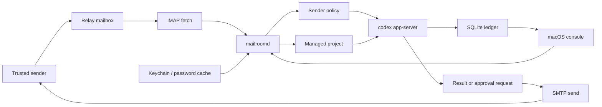

# Architecture Overview

Patch Courier turns trusted email threads into local Codex work while keeping execution, repository access, credentials, and policy state on the operator's Mac.

## Main Components

- `PatchCourierMac`: native macOS operator console. It reads daemon state, configures mailboxes, sender policies, and managed projects, and can resolve approvals against the live daemon session.
- `mailroomd`: long-lived daemon. It owns mailbox polling, durable thread/turn recovery, policy routing, the local control server, and the Codex app-server session.
- `codex app-server`: local Codex runtime launched by the daemon over stdio JSON-RPC.
- SQLite store: durable local state for threads, turns, approvals, events, mailbox config, mailbox cursors, processed inbound messages, and poll incidents.
- Keychain-backed secret store: mailbox passwords stay out of SQLite and `.env` files.
- IMAP/SMTP transport helper: mailbox fetch/send boundary used by one-shot sync and the long-running mail loop.

## Runtime Flow

1. A trusted sender sends a request to the relay mailbox.
2. `mailroomd` fetches the message, de-duplicates it by mailbox UID, and records the inbound handling state.
3. The daemon evaluates sender policy and either rejects, saves for later, asks for first-contact confirmation, asks for a managed project, or starts a Codex turn.
4. Codex work runs locally under the configured workspace root and app-scoped `CODEX_HOME`.
5. If Codex needs approval or input, Patch Courier sends a structured reply email and records the approval request.
6. Completion, failure, and approval outcomes are written to SQLite and sent back through SMTP.
7. The macOS app reads the daemon control file and shows threads, turns, mailbox health, approvals, worker lanes, and recent incidents.

## Trust Boundaries

- Sender trust is policy state, not prompt text.
- Workspace selection is constrained by sender policy and managed project configuration.
- Mailbox passwords are stored through Keychain-backed secret storage and should not be committed or placed in `.env` files.
- `MAILROOM_CODEX_HOME` is app-owned runtime state; `MAILROOM_CODEX_PROFILE_HOME` is only the source profile mirrored into that runtime.
- SQLite schema compatibility is tracked with `PRAGMA user_version`; see `docs/STORAGE_MIGRATIONS.md`.

## Contributor Entry Points

- Start with the README local probe path before configuring mail.
- Use `./scripts/render_mail_previews.sh` when editing outbound email templates.
- Use `MailroomDaemonTests` for daemon logic, parser behavior, fixture coverage, and migration behavior.
- Use `docs/TARGET_ARCHITECTURE.md` for deeper design intent once the first-run path is working.
